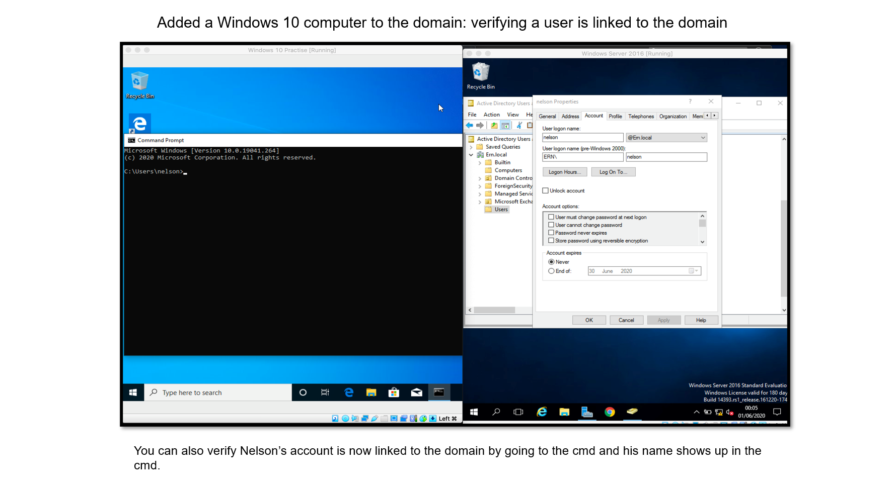

# WindowsServer-2016-Lab
## Windows Server 2016 Lab
 
### Lab:
<li>Using Active Directory
<li>How to reset a password on this server
<li> to add a user to a group in multiple ways
<li>Map a shared drive with a letter
<li>Server 2016 how to map share drive automatically when logging into the server using active directory
<li>Unlocked user account for user to regain access to their account
<li>Disabled a user account
<li>Created group in Active Directory
<li>Used Exchange Server 2016: Utilized Office Exchange 365 created a Distribution Group and added a user
<li>Added a Windows 10 computer to the domain: verifying a user is linked to the domain

### Software used:
Virtual Box: to run Windows Server 2016 and Windows 10

[Your Link Here](https://github.com/EA-IT2/WindowsServer-2016-Lab/blob/main/IT%20Support%20lab%20Windows%20server%202016.pdf)

([src/IT Support lab Windows server 2016.pdf](https://github.com/EA-IT2/WindowsServer-2016-Lab/blob/main/IT%20Support%20lab%20Windows%20server%202016.pdf)) 

Long version of this lab can be viewed as a pdf located in the file section, when located keep pressing more pages button or if the more pages button disappears press the git hub logo that is loading. 

 
 
 

 
 

 

 

 
 

 
 

 
 

 
 

 
 

 

 

